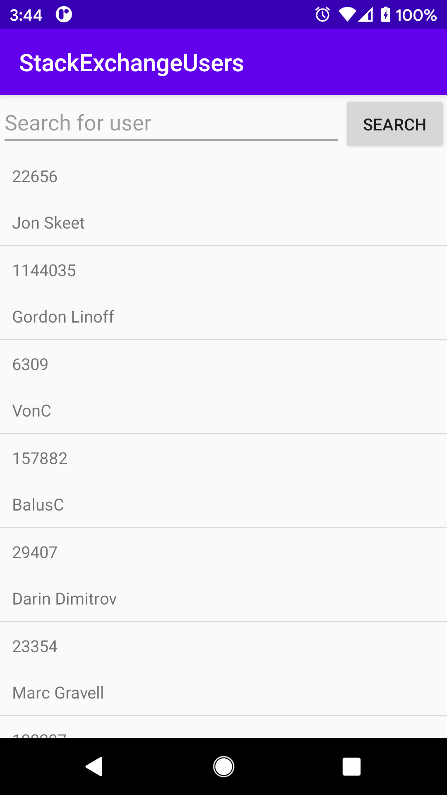
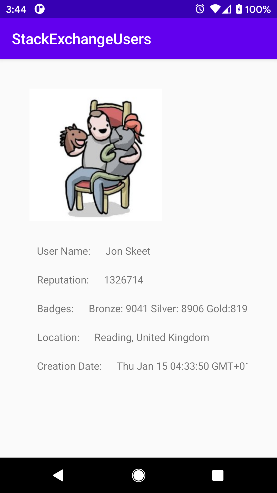

Okay, I think this task is over now. Not everything has been done and some things could have been done better.

In the case of such a layout, where we have two screens, one with a list and the other with details, two approaches are possible. The first is one query for the server and data storage in the application, the second is two independent queries. In this case, I chose the former because I mis noticed that the tag list is only returned to the query using accountId. The tag list is returned differently depending on the user: D My Error.

Navigating between passages is very simple here. Only by passing the accountId for the next API request. This could be extended with a Navigation Component.

You would have to add styles and theme. I ran out of time for this.

